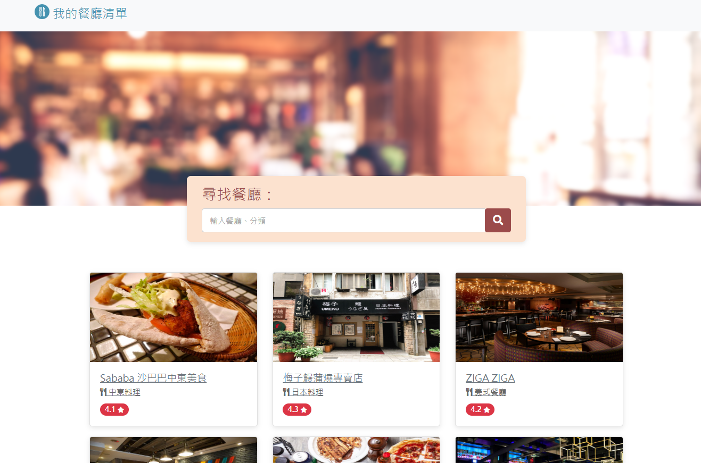
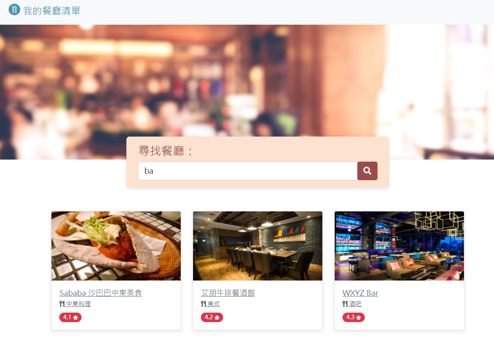

# AC-exercise-project：restaurant-list
這是一份使用Express伺服器建構及以express-handlebars渲染畫面的餐廳清單，收集各家餐廳詳細資訊，並可依照需求找尋目標餐廳

## 專案目錄
- [Demo views - 專案畫面](#demo-views---專案畫面)
- [Features - 產品功能](#features---產品功能)
- [Prerequisites - 環境建置與需求](#prerequisites---環境建置與需求)
- [Installation and execution - 安裝與執行](#installation-and-execution---安裝與執行)
- [Contributor - 開發人員](#contributor---開發人員)

## Demo views - 專案畫面
**主畫面**

**餐廳詳細資訊**

**搜尋頁面**


## Features - 產品功能
用戶能夠透過此網站：
- 查看所有餐廳列表
- 查看所有餐廳詳細資訊
- 輸入關鍵字尋找餐廳或相關內容

## Prerequisites - 環境建置與需求
請確保您已建置以下環境、框架及工具：
- Node.js - v18.15.0
- Express.js - v4.19.2
- Nodemon - v3.1.3
- Bootstrap - v5.2.1
- font-awesome - v5.8.1
- Express-handlebars - v7.1.3

## Installation and execution - 安裝與執行
**以下指令請輸入於終端機**
1. Clone 專案到本地
```
git clone https://github.com/momochch/restaurant-list.git
```

2. 進入此專案資料夾
```
cd restaurant-list
```

3. 安裝npm套件
```
npm install
```

4. 確保"環境建置與需求"皆已建立

5. 執行app.js
```
npm run dev
```

6. 執行成功：
當出現以下字樣，表示伺服器與資料庫已啟動並成功連結，若要結束請按"ctrl+c"
```
express server is running on http://localhost:3000
```

請打開瀏覽器進入網址輸入[http://localhost:3000](http://localhost:3000) 開始使用餐廳清單

## Contributor - 開發人員
- [momochch](https://github.com/momochch) - 根據project template以Express伺服器建立此專案
- [Alpha camp](https://tw.alphacamp.co/) - 提供project template
